# My Personal website

Check it out at [lovergne.dev](https://lovergne.dev)

This website is a place where I can experiment and be creative. I mostly publish links to
external resources that I have found interesting or thought-provoking (and some fun stuff), think
of it as my personal web library. I also write about some of my personal projects, but this is rarer.

The source code is mainly HTML and CSS with just a little bit of javascript sprikle in. 
Then I use Astro for static site generation and there is no other dependency ( well technically there
is [normalize.css](https://csstools.github.io/normalize.css/11.0.0/normalize.css) but it's so small
it doesn't count!).

## Features: 

- **Fully accessible:** built with semantic HTML and accessibility in mind
- **Light and Fast:** 24.16kB landing page.
- **It's simple** and has minimal runtime dependency.
- **It's beautiful**, well for me at least. And I really my little isometric logo. 
- **Dark / Light** theme based on `prefers-color-scheme`
- **Sufficient SEO support**: see [Meta.astro](https://github.com/TheBigRoomXXL/my-site/blob/main/src/components/Meta.astro)
- **Print support** with a minimal secondary stylesheet (see [print.css](https://github.com/TheBigRoomXXL/my-site/blob/main/public/print.css)). I don't think anybody else care about that but I like it.
- **Awesome list** page generated from data files.
- **RSS** support

## Lighthouse Score

  <a href="https://pagespeed.web.dev/analysis/https-lovergne-dev/jml08tnarx?form_factor=mobile">
    
  <a>

## Acknowledgement

This site was originally inspired by the [cactus theme](https://astro-theme-cactus.netlify.app/) for astro but I decided do my own thing as I wanted less dependencies and tooling. The [Meta](/src/components/Meta.astro) component originaly come from there and you can clearly see some similarity in the visual design.
